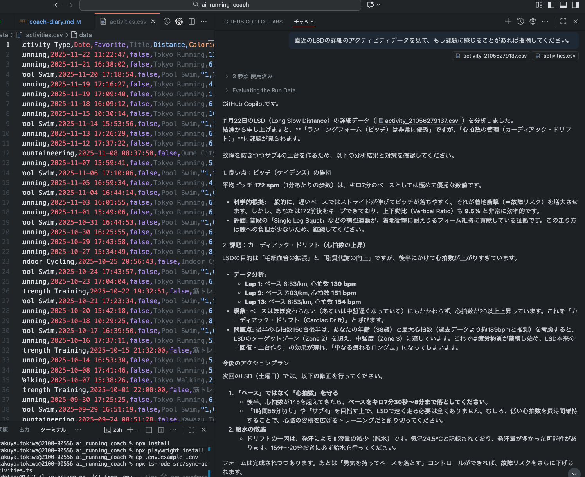

# AI Running Coach - Usage Guide
AI Running Coach is a project that provides an AI assistant as a personal coach for Garmin users. It has the following two features:

1. Download activity data from Garmin Connect
2. Provide personal coaching to the user through an AI IDE



## Setup
1. Copy `.env.example` to `.env` and fill in your Garmin Connect credentials.
   ```bash
   cp .env.example .env
   ```
2. Install dependencies:
   ```bash
   npm install
   ```

   Playwright dependencies:
   ```bash
   npx playwright install
   ```
3. Configure Coach: 
- Edit `coach-instructions.md` based on the given template.
- Rename and move `coach-instructions.md` to the appropriate location for your AI IDE. This allows the AI to automatically read the instructions.
   - VS Code (GitHub Copilot): .github/copilot-instructions.md
   - Cursor: .cursorrules

## Usage
1. **Sync Data**: Run the sync script to download and update your running logs.
   ```bash
   npx ts-node src/sync-activities.ts
   ```
   *Note: This will launch a browser to log in to Garmin Connect. If it fails, try setting `HEADLESS=false` in `.env`.*

2. **Chat with Coach**: Open the chat panel in your IDE. Add `data/activities.csv`, `coach-diary.md`, and any other relevant files to the chat context, then ask for advice. The AI will read `coach-instructions.md` and provide personalized feedback.

3. **Record Coaching Session**: Use AI agent mode to update `coach-diary.md` with a summary of the session. If your IDE requires a separate session for agent mode, copy and paste the relevant chat history into the agent's context or update the diary manually.
